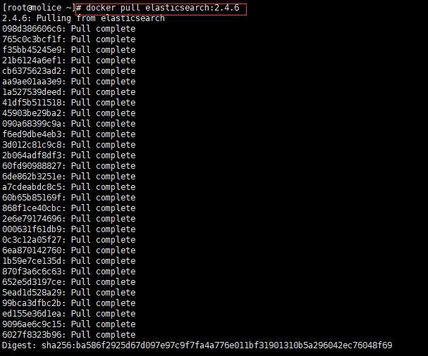
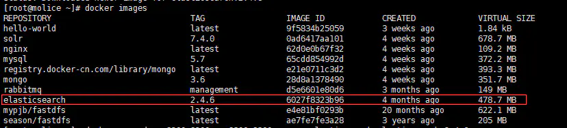
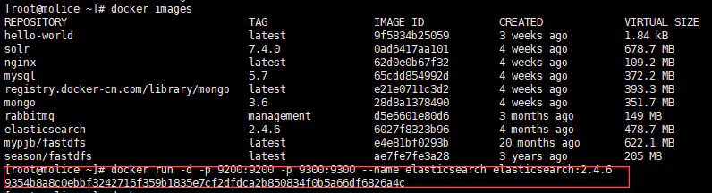
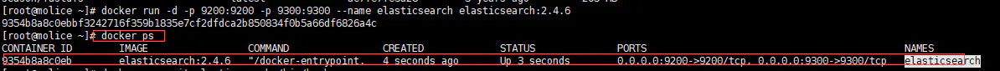
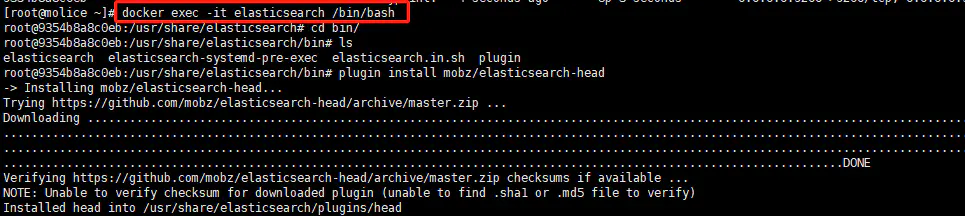
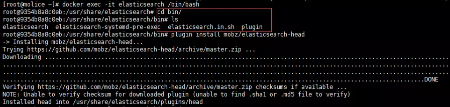

# docker下安装elasticsearch

# 1、查找elasticsearch版本

```undefined
docker search elasticsearch
```
# 2、选择一个版本，拉取镜像（本次拉取是2.4.6）

```css
docker pull elasticsearch:2.4.6
```


# 3、查看镜像

```undefined
docker images
```

# 4、通过镜像，启动一个容器，并将9200和9300端口映射到本机
```css
docker run -d -p 9200:9200 -p 9300:9300 --name elasticsearch elasticsearch:2.4.6
```

# 5、查看已启动容器
```undefined
docker ps
```

 验证是否安装成功？访问：(本机ip地址:9200)
http://192.168.43.107:9200


# 6、安装插件，先进入容器：

```bash
docker exec -it elasticsearch /bin/bash
```


# 7、进入容器bin目录，并执行安装插件命令：

```bash
cd bin
ls 
plugin install mobz/elasticsearch-head
```


 访问：
http://192.168.43.107:9200/_plugin/head/


插件安装成功